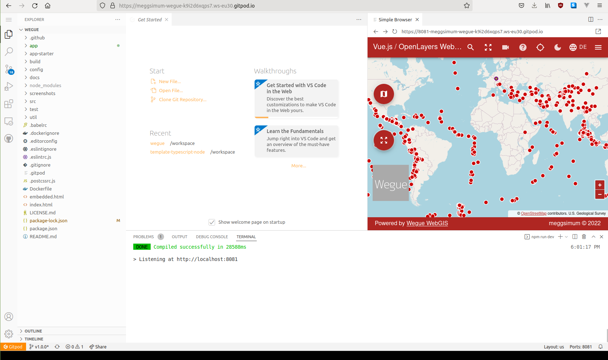
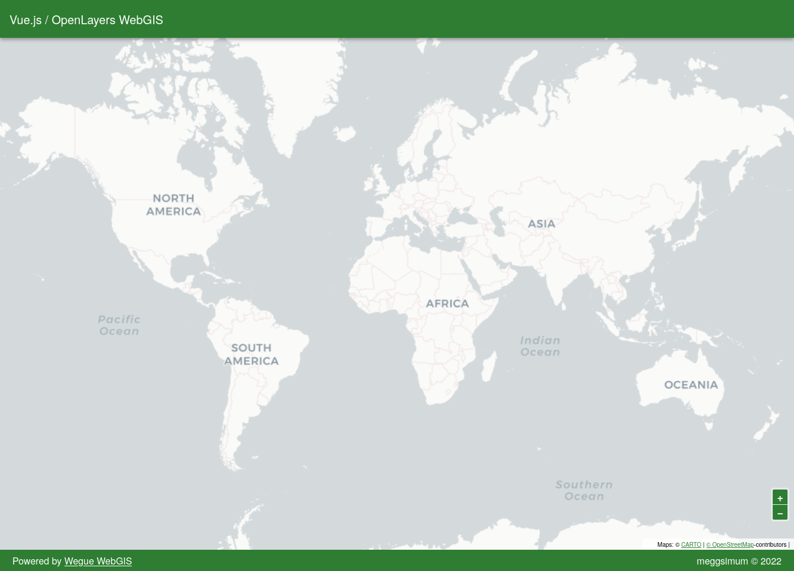
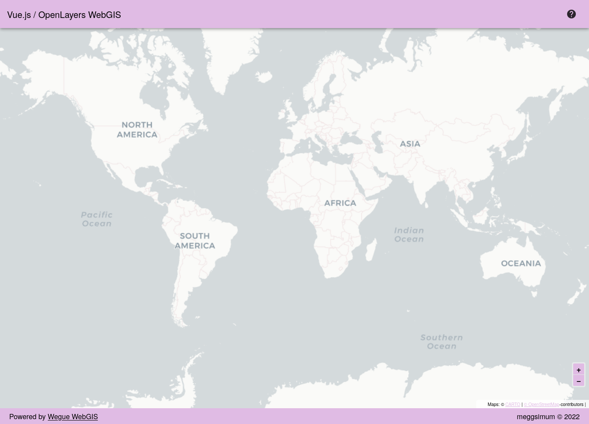
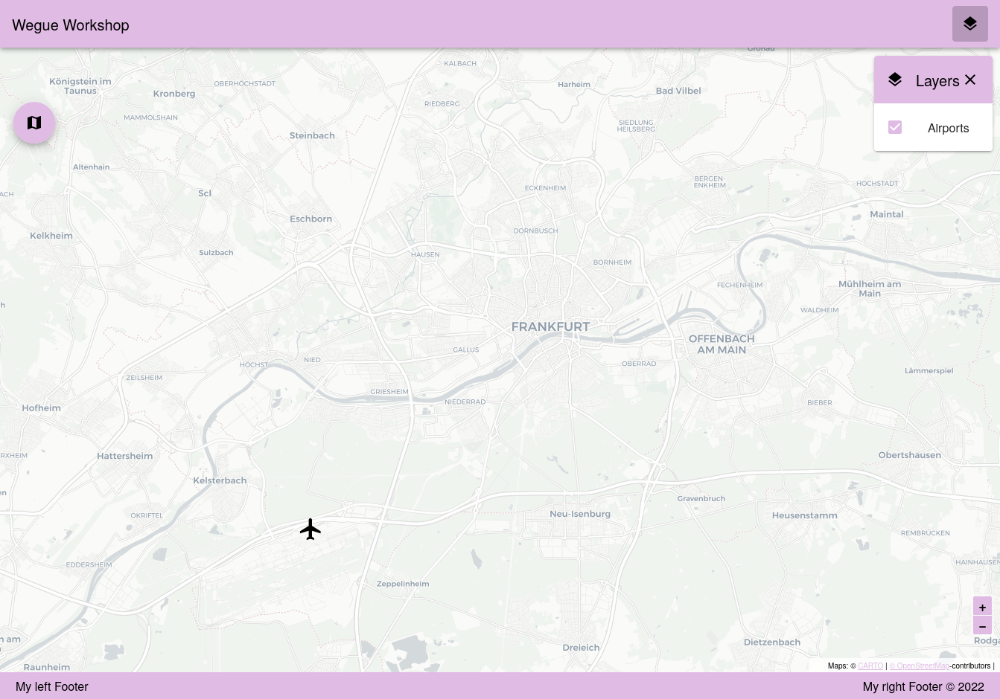
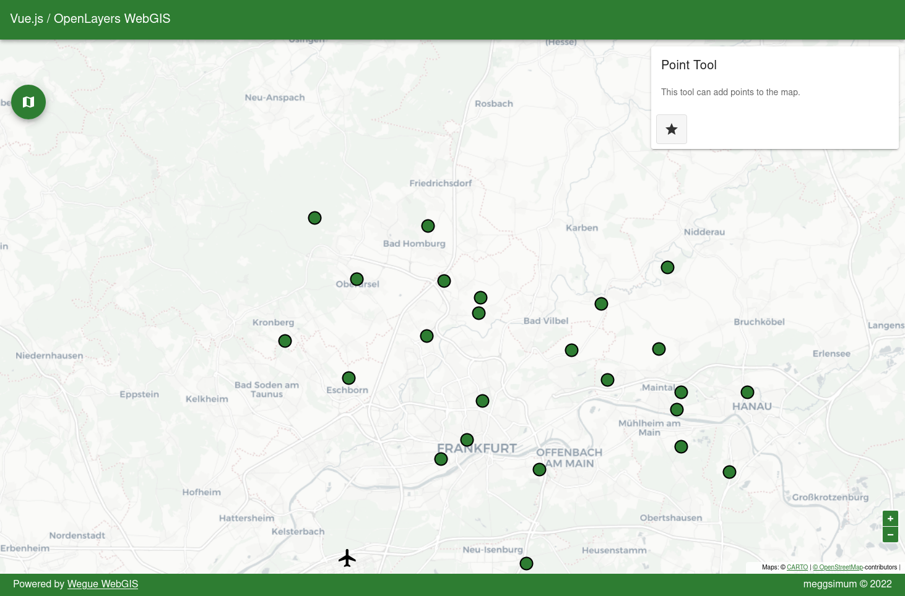
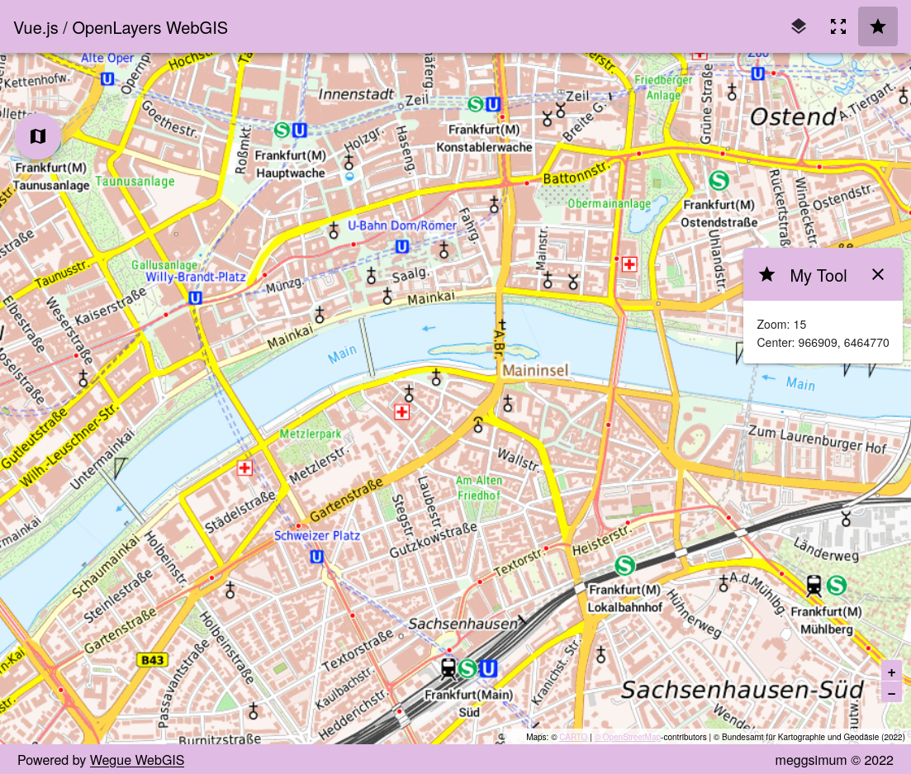
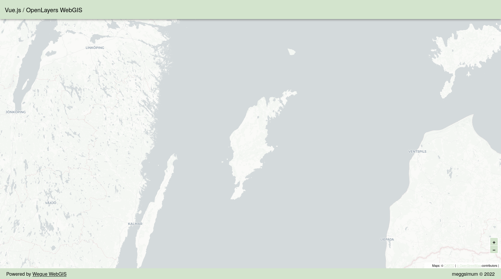

# Workshop

This workshop uses Wegue version [`v1.2.0`](https://github.com/wegue-oss/wegue/releases/tag/v1.2.0) but works for higher versions with no or little adaptation.

## Prerequisites

You should have basic knowledge of using a commandline and a basic understanding of HTML, CSS and JavaScript. Also basic knowledge of Vue.js is helpful but not mandatory.

## Preparation

### Browser-based Setup

For this workshop or to quickly try something, you can use the online-environment Gitpod. For this you need a browser and you need to register at Gitpod. That can be done with an existing GitHub account.

To get started navigate to [**gitpod.io/#https://github.com/wegue-oss/wegue/tree/v1.2.0**](https://gitpod.io/#https://github.com/wegue-oss/wegue/tree/v1.2.0). Ideally, you will see a terminal running commands to set up Wegue. After some moments (~1 minute) you should see a running Wegue instance in one of the editor's panes like in this screenshot.



### Local Setup

For serious projects Wegue should be installed on your computer. This works on Windows, Linux and Mac computers. For creating a development setup you need to install these programs:
- [node.js](https://nodejs.org) - The JavaScript runtime needed for developing.
- any text editor - [VSCode](https://code.visualstudio.com/) is a good choice, but others will work as well.
- a modern and up-to-date web browser - [Firefox](https://www.mozilla.org/en-US/firefox/new/), [Chrome](https://www.google.com/chrome/) are good choices, but others might work as well.

We need to download Wegue. This can be done in two ways:
- Preferably via [`git`](https://git-scm.com/downloads) using this command:

    ```
    # first navigate to a convenient location
    # cd /ENTER/A/LOCATION/FOR/THE/CODE

    # clone the Wegue git repository
    git clone https://github.com/wegue-oss/wegue

    # enter the Wegue directory
    cd wegue

    # checkout the version of the Workshop
    git checkout v1.2.0
    ```

- Alternatively download a zip-archive of Wegue via GitHub using this [link](https://github.com/wegue-oss/wegue/archive/refs/tags/v1.2.0.zip) and extract it.

## Start Wegue

Wegue is a web mapping application based on the Vue.js framework, the OpenLayers library and some other dependencies. These are all noted in the file `package.json` under the property `dependencies`. To download all of them we use `npm`. This is node package manager which comes preinstalled with `node.js`. Open your terminal and ensure you are in the `wegue` directory and enter the following command:

```shell
# download all dependencies in its respective versions
npm install
```

The idea of Wegue is quickly develop a custom application without any modification of the core code. Typically all custom changes are done in the directory `app`. Initially this directory is empty. It can be filled with this command:

```shell
npm run init:app
```

Now we have everything ready to start a local Wegue application that we can view on our computer using this command:

```shell
npm run dev
```

It assembles all the source files of Wegue and publishes them on a local webserver via port `8081`. This can take up to one minute. To view it open [localhost:8081](http://localhost:8081) in your web browser. Then you should see the a default Wegue web mapping application.


## Adapt the Configuration

Of course, we would like to create our custom Wegue application. This is done in the `app` directory, whose content looks like this:

```
app
├── components
│   ├── AppFooter.vue
│   ├── AppHeader.vue
│   └── AppSidebar.vue
├── locales
│   ├── de.json
│   └── en.json
├── README.md
├── static
│   ├── app-conf.json
│   ├── app-conf-minimal.json
│   ├── app-conf-projected.json
│   ├── app-conf-sidebar.json
│   ├── css
│   │   └── app.css
│   ├── data
│   │   ├── 2012_Earthquakes_Mag5.kml
│   │   └── shops-dannstadt.geojson
│   └── icon
│       ├── circle.svg
│       └── favicon.ico
├── WguAppTemplate.vue
└── WguApp.vue
```

For the moment we will look at the `static` directory. As the name implies, it contains static content like images, CSS files, (geo)data or configuration files. The configuration files are the central point to change the behavior of Wegue.

The file `app-conf.json` controls the Wegue instance you can see in your browser. It defines the map layers that shall be seen and also defines which features of Wegue shall be used. The default config file looks overwhelming on first sight. That's why, we replace it with a minimal configuration file,

Replace the content of `app-conf.json` with this:

```json
{

  "colorTheme": {
    "themes": {
      "light": {
        "primary": "#2E7D32"
      }
    }
  },

  "mapZoom": 2,
  "mapCenter": [0, 0],

  "mapLayers": [
    {
      "type": "XYZ",
      "name": "Carto Positron",
      "url": "https://basemaps.cartocdn.com/light_all/{z}/{x}/{y}.png",
      "lid": "positron",
      "attributions": "Maps: © <a href='https://carto.com/attribution/' target='_blank'>CARTO</a> | <a href='https://openstreetmap.org/copyright' target='_blank'>© OpenStreetMap</a>-contributors | "
    }
  ]
}
```

Open your browser that runs Wegue and refresh the page (typically pressing F5 on your keyboard). Now you should see this web map:



The current color is green and defined via a RGB-code. Change it to `#E0BBE4` (a kind of purple) or any other color you like. You can use a [color picker](https://www.w3schools.com/colors/colors_picker.asp) for finding your desired RGB-code. After a refresh of your browser tab, you should see the new color.



When a user opens the map it will initially show the whole world. Let's say we would like to focus our map on Frankfurt in Germany. We would need to change the two properties `mapCenter` and `mapZoom`.

The `mapCenter` is a coordinate in the projection of the map. In our case the default projection "web mercator" with the code `EPSG:3857` is used. For finding the coordinate you can use [this website](https://epsg.io/map#srs=3857&x=965552.541298&y=6466228.626299&z=11&layer=streets). The result might be `965552.541298 6466228.626299`. We must convert them to a JSON Array by surrounding them with bracket `[]` and separating them by a comma `,`. Additionally, We can safely remove the numbers behind the digit, because are unnecessarily precise.

The `zoomLevel` is a whole number typically between `0`(whole world) and `18` (building level). For displaying a city `11` might be a good value.

Let's apply the values to our config file. Change `mapZoom` and `mapCenter` to:

```
  "mapZoom": 11,
  "mapCenter": [965552, 6466228],
```

The text strings of the application are changed in a different file, namely `app-starter/locales/en.json`. When you open the file, you will see numerous entries. Most of them we do not need for our application yet. Replace the content of the file with this:

```json
{
  "app": {
    "title": "Vue.js / OpenLayers WebGIS",
    "footerTextLeft": "Powered by <a href='https://meggsimum.de/wegue/' target='_blank'>Wegue WebGIS</a>",
    "footerTextRight": "meggsimum"
  }
}
```
Here you can change the text elements, for example to this:

```json
{
  "app": {
    "title": "Wegue Workshop",
    "footerTextLeft": "My left Footer",
    "footerTextRight": "My right Footer"
  }
}
```

## Add layers

At the moment we have one layer in our `app-conf.json`. It is defined in the property `mapLayers` as one item of an array. Before we add a new layer, let's try to understand the structure of a layer object by checking our current layer:

- `"type": "XYZ"` defines the type of the layer. Wegue supports many other types like `WMS`, `WFS`, or `VECTOR` (see the [layer docs](https://wegue-oss.github.io/wegue/#/map-layer-configuration) for details)
- `"name": "Carto Positron"` the layer name used in the UI, so visible to the user
- `"url": "https://basemaps.cartocdn.com/light_all/{z}/{x}/{y}.png"` is the URL where the data of the layer comes from
- `"lid": "positron"` defines a "layer ID", this is necessary to uniquely reference a layer
- `"attributions": "..."` describes the attributions or the copyright of the layer

Now we want to add a point layer with airports. The layer object looks like this:

```json
{
    "type": "VECTOR",
    "format": "GeoJSON",
    "lid": "airports",
    "name": "Airports",
    "url": "https://raw.githubusercontent.com/martynafford/natural-earth-geojson/90266457d82d3717e47313e72a921e31a087d2c4/50m/cultural/ne_50m_airports.json"
}
```
We use the type `VECTOR` which can load vector features from different formats indicated by the `format` property. In our case our `format` is `GeoJSON`. The url references to a publicly available GeoJSON hosted on Github holding airports. The data originates from [Natural Earth](https://www.naturalearthdata.com/). Data from there does not require attribution.

Add our new layer object before the previous layer and ensure both layer objects are separated by a comma. The final `mapLayer` property should look like this:


```json
"mapLayers": [
    {
        "type": "VECTOR",
        "format": "GeoJSON",
        "lid": "airports",
        "name": "Airports",
        "url": "https://raw.githubusercontent.com/martynafford/natural-earth-geojson/90266457d82d3717e47313e72a921e31a087d2c4/50m/cultural/ne_50m_airports.json"
    },
    {
        "type": "XYZ",
        "name": "Carto Positron",
        "url": "https://basemaps.cartocdn.com/light_all/{z}/{x}/{y}.png",
        "lid": "positron",
        "attributions": "Maps: © <a href='https://carto.com/attribution/' target='_blank'>CARTO</a> | <a href='https://openstreetmap.org/copyright' target='_blank'>© OpenStreetMap</a>-contributors | "
    }
]
```

Refresh your map in the browser and you should see the airport of Frankfurt in the lower left part of the map indicated by a blue circle. Admittedly, the airport is difficult to recognize. A more prominent styling would be great!

We can do this by adding the property `style` to our layer object. There are multiple options for styling vector layers (see the [style docs](https://wegue-oss.github.io/wegue/#/map-layer-configuration?id=style-for-vectorlayers) for details). A common option is to define a circle. It will show a black circle with a white stroke:

```json
  "style": {
        "radius": 4,
        "strokeColor": "white",
        "strokeWidth": 2,
        "fillColor": "black"
      },
```

We can also use icons, like a plane, using a [icon font](https://fonts.google.com/icons?selected=Material+Icons&icon.query=airport):

```json
"style": {
  "textIcon": "local_airport",
  "font": "normal 35px Material Icons",
  "fillColor": "black"
},
```

The full layer object would look like this:

```json
{
  "type": "VECTOR",
  "format": "GeoJSON",
  "lid": "airports",
  "name": "Airports",
  "style": {
    "textIcon": "local_airport",
    "font": "normal 35px Material Icons",
    "fillColor": "black"
  },
  "url": "https://raw.githubusercontent.com/martynafford/natural-earth-geojson/90266457d82d3717e47313e72a921e31a087d2c4/50m/cultural/ne_50m_airports.json"
}
```

The "positron" basemap we are using, (intentionally) does not show much context. Let's add a basemap with more details. This time we take our layer from a WMS source:

```json
 {
    "type": "TILEWMS",
    "name": "TopPlusOpen",
    "url": "https://sgx.geodatenzentrum.de/wms_topplus_open?",
    "layers": "web",
    "lid": "topplusopen",
    "attributions": "© Bundesamt für Kartographie und Geodäsie (2022)"
  }
```

Note the new property `layers` which is specific for a `WMS` layer. Add this layer between the "airports" layer and the "positron" layer. Now our background shows more detail, but we cannot see our previous basemap anymore.

For this problem Wegue has an inbuilt solution called "basemap switcher". Add the property `"isBaseLayer": true` to both basemap layers. Wegue will then display a button on the top left side of the map, where you can chose which baselayer should be shown.


This is how the `mapLayers` property should look like:

```json
 "mapLayers": [
      {
        "type": "VECTOR",
        "format": "GeoJSON",
        "lid": "airports",
        "name": "Airports",
        "style": {
          "textIcon": "local_airport",
          "font": "normal 35px Material Icons",
          "fillColor": "black"
        },
        "url": "https://raw.githubusercontent.com/martynafford/natural-earth-geojson/90266457d82d3717e47313e72a921e31a087d2c4/50m/cultural/ne_50m_airports.json"
      },
      {
        "type": "TILEWMS",
        "name": "TopPlusOpen",
        "url": "https://sgx.geodatenzentrum.de/wms_topplus_open?",
        "layers": "web",
        "lid": "topplusopen",
        "isBaseLayer": true,
        "attributions": "© Bundesamt für Kartographie und Geodäsie (2022)"
      },
      {
        "type": "XYZ",
        "name": "Carto Positron",
        "url": "https://basemaps.cartocdn.com/light_all/{z}/{x}/{y}.png",
        "lid": "positron",
        "isBaseLayer": true,
        "attributions": "Maps: © <a href='https://carto.com/attribution/' target='_blank'>CARTO</a> | <a href='https://openstreetmap.org/copyright' target='_blank'>© OpenStreetMap</a>-contributors | "
      }
    ]
```

## Use a module

Wegue contains a lot of different modules that can be used. A frequently needed one is a layer switcher. This enables the user to switch layers on and off. To activate it, add this snippet below to your config file. Make sure it is located on the top level and also separated by a comma from other properties:

```json
  "modules": {
      "wgu-layerlist": {
        "target": "toolbar",
        "win": "floating",
        "icon": "layers"
      }
    }
```
Let's inspect what is happening here. The property `modules` is a JSON object with currently one object. However, there can be many more. Our module is called `wgu-layerlist` and has some properties by itself as well:

- `"target": "toolbar"` adds the button for the layer list to the toolbar, alternatively it can be added to a menu using `"target": "menu"`
- `"win": "floating"` tells Wegue to place the module floating over the map, alternatively `"win": "sidebar",` would place it in a sidebar
- `"icon": "layers"` defines the icon image that is displayed, it can be chosen from the same [icon font](https://fonts.google.com/icons?selected=Material+Icons&icon.query=airport) that we used earlier for the layer style

The layer list on the top right enables us to switch the airport layer on and off.



Another frequently used module is a "zoom-to-max-extent"-button. It can be added via the snippet below. Clicking the button restores the initial map extent.

```json
"wgu-zoomtomaxextent": {
    "target": "toolbar"
  }
```

The whole config file should look like this:

```json
  {
    "colorTheme": {
      "themes": {
        "light": {
          "primary": "#E0BBE4"
        }
      }
    },
    "mapZoom": 11,
    "mapCenter": [
      965552,
      6466228
    ],
    "mapLayers": [
      {
        "type": "VECTOR",
        "format": "GeoJSON",
        "lid": "airports",
        "name": "Airports",
        "style": {
          "textIcon": "local_airport",
          "font": "normal 35px Material Icons",
          "fillColor": "black"
        },
        "url": "https://raw.githubusercontent.com/martynafford/natural-earth-geojson/90266457d82d3717e47313e72a921e31a087d2c4/50m/cultural/ne_50m_airports.json"
      },
      {
        "type": "TILEWMS",
        "name": "TopPlusOpen",
        "url": "https://sgx.geodatenzentrum.de/wms_topplus_open?",
        "layers": "web",
        "lid": "topplusopen",
        "isBaseLayer": true,
        "attributions": "© Bundesamt für Kartographie und Geodäsie (2022)"
      },
      {
        "type": "XYZ",
        "name": "Carto Positron",
        "url": "https://basemaps.cartocdn.com/light_all/{z}/{x}/{y}.png",
        "lid": "positron",
        "isBaseLayer": true,
        "attributions": "Maps: © <a href='https://carto.com/attribution/' target='_blank'>CARTO</a> | <a href='https://openstreetmap.org/copyright' target='_blank'>© OpenStreetMap</a>-contributors | "
      }
    ],
    "modules": {
      "wgu-layerlist": {
        "target": "toolbar",
        "win": "floating",
        "icon": "layers"
      }
    }
  }
```


## Custom Functionality

Now we will have a look a the file `WguApp.vue`. This file can be used for adding custom functionality to the app. Let's create a little tool for adding points on the map.

First of all we need a new layer that can hold our points. So far we added layers via the config file, but we can also do this programmatically using OpenLayers directly. We can do this directly in the `WguApp.vue` by replacing its contents with this:

```vue
<template>
  <wgu-app-tpl>
  </wgu-app-tpl>
</template>

<script>
import { Mapable } from '../src/mixins/Mapable';
import WguAppTemplate from './WguAppTemplate.vue';
import VectorLayer from 'ol/layer/Vector'
import VectorSource from 'ol/source/Vector'
import { Circle as CircleStyle, Fill, Stroke, Style } from 'ol/style';
import Feature from 'ol/Feature';
import Point from 'ol/geom/Point';

export default {
  name: 'my-wgu-app',
  mixins: [Mapable],
  components: {
    'wgu-app-tpl': WguAppTemplate
  },
  methods: {
    /**
     * Executed once map is bound.
     */
    onMapBound () {
      // create a vector source
      const vectorSource = new VectorSource();

      // create a style
      const vectorStyle = new Style({
        image: new CircleStyle({
          radius: 10,
          fill: new Fill({
            color: '#2E7D32'
          }),
          stroke: new Stroke({
            color: 'black',
            width: 2
          })
        })
      });

      // add the source and the style to the layer
      const vectorLayer = new VectorLayer({
        title: 'Points of Interest',
        source: vectorSource,
        style: vectorStyle
      });

      // add the layer to the map
      this.map.addLayer(vectorLayer);

      // add a feature to the map
      vectorSource.addFeature(
        new Feature({
          geometry: new Point([965552, 6466228])
        })
      );
    }
  }
}
</script>
```

We include the mixing `Mapable`, we need that for accessing the map. The function `onMapBound()` is automatically executed once the map is bound. Here we can write plain JavaScript and access our OpenLayers map and add a layer containing a single point.

In the next step we want to make it possible to add more points to the layer by clicking on the map. This can be done using a [`DrawInteraction`](https://openlayers.org/en/latest/apidoc/module-ol_interaction_Draw-Draw.html). This is the new content of `WguApp.vue`:

```vue
<template>
  <wgu-app-tpl>
  </wgu-app-tpl>
</template>

<script>
import { Mapable } from '../src/mixins/Mapable';
import WguAppTemplate from './WguAppTemplate.vue';
import VectorLayer from 'ol/layer/Vector'
import VectorSource from 'ol/source/Vector'
import { Circle as CircleStyle, Fill, Stroke, Style } from 'ol/style';
import Feature from 'ol/Feature';
import Point from 'ol/geom/Point';
import DrawInteraction from 'ol/interaction/Draw';

export default {
  name: 'my-wgu-app',
  mixins: [Mapable],
  components: {
    'wgu-app-tpl': WguAppTemplate
  },
  methods: {
    /**
     * Executed once map is bound.
     */
    onMapBound () {
      // create a vector source
      const vectorSource = new VectorSource();

      // create a style
      const vectorStyle = new Style({
        image: new CircleStyle({
          radius: 10,
          fill: new Fill({
            color: '#2E7D32'
          }),
          stroke: new Stroke({
            color: 'black',
            width: 2
          })
        })
      });

      // add the source and the style to the layer
      const vectorLayer = new VectorLayer({
        title: 'Points of Interest',
        source: vectorSource,
        style: vectorStyle
      });

      // add the layer to the map
      this.map.addLayer(vectorLayer);

      // add a feature to the map
      vectorSource.addFeature(
        new Feature({
          geometry: new Point([965552, 6466228])
        })
      );

      // create a draw interaction and
      // store it as a property to the module
      // so we can reference it later on
      this.draw = new DrawInteraction({
        source: vectorSource,
        type: 'Point'
      });

      // add it to the map
      this.map.addInteraction(this.draw);
    }
  }
}
</script>
```

When you refresh the app in your browser. You can instantly add points to the map by clicking with your cursor on a location. Like in this screenshot.


As you probably notice, there is currently no way to deactivate the drawing behavior. We can fix this by adding a custom UI element for that. Use that code for it:

```vue
<template>
  <wgu-app-tpl>

    <v-card
      class="myCard"
      slot="wgu-before-content"
    >
      <v-card-title>
        Point Tool
      </v-card-title>

      <v-card-text>
        This tool can add points to the map.
      </v-card-text>

      <v-card-actions>
        <v-btn-toggle v-model="buttonValue">
          <v-btn>
            <v-icon dark>
              mdi-star
            </v-icon>
          </v-btn>
        </v-btn-toggle>
      </v-card-actions>

    </v-card>
  </wgu-app-tpl>
</template>

<script>
import { Mapable } from '../src/mixins/Mapable';
import WguAppTemplate from './WguAppTemplate.vue';
import VectorLayer from 'ol/layer/Vector'
import VectorSource from 'ol/source/Vector'
import { Circle as CircleStyle, Fill, Stroke, Style } from 'ol/style';
import Feature from 'ol/Feature';
import Point from 'ol/geom/Point';
import DrawInteraction from 'ol/interaction/Draw';

export default {
  name: 'my-wgu-app',
  mixins: [Mapable],
  components: {
    'wgu-app-tpl': WguAppTemplate
  },
  data() {
    return {
      buttonValue: undefined
    }
  },
  watch: {
    /**
     * Executed once the button value changes
     */
    buttonValue(value) {
      // the button is pressed when its value is 0
      const buttonPressed = (value === 0);

      if (buttonPressed) {
        // we activate our draw tool
        this.draw.setActive(true);
      } else {
        // we deactivate our draw tool
        this.draw.setActive(false);
      }
    }
  },
  methods: {
    /**
     * Executed once map is bound.
     */
    onMapBound () {
      // create a vector source
      const vectorSource = new VectorSource();

      // create a style
      const vectorStyle = new Style({
        image: new CircleStyle({
          radius: 10,
          fill: new Fill({
            color: '#2E7D32'
          }),
          stroke: new Stroke({
            color: 'black',
            width: 2
          })
        })
      });

      // add the source and the style to the layer
      const vectorLayer = new VectorLayer({
        title: 'Points of Interest',
        source: vectorSource,
        style: vectorStyle
      });

      // add the layer to the map
      this.map.addLayer(vectorLayer);

      // add a feature to the map
      vectorSource.addFeature(
        new Feature({
          geometry: new Point([965552, 6466228])
        })
      );

      // create a draw interaction and
      // store it as a property to the module
      // so we can reference it later on
      this.draw = new DrawInteraction({
        source: vectorSource,
        type: 'Point'
      });

      // initially deactivate draw tool
      this.draw.setActive(false);

      // add it to the map
      this.map.addInteraction(this.draw);
    }
  }
}
</script>

<style>
  .myCard{
    width: 400px;
    position: absolute;
    top: 75px;
    right: 10px;
    z-index: 1;
  }
</style>

```

Refresh the app in your browser and you should see a card in the top right corner of the map. It contains a button. Once it is pressed, it is possible to add points to the map via clicking - and of course vice versa. See screenshot below.



The next logical step would be to add the possibility to delete points. But this would exceed the extent of this workshop.

Let's review what we have done: We added functionality by directly writing code to `WguApp.vue`. This is totally legitimate and fine for many use cases. However, once the functionality becomes more complex or should be shared with other applications, it is recommend to encapsulate this functionality in separate modules. This is explained in the next section.

## Add a custom module

So far we modified the functionality of Wegue using the configuration file or by writing code into `WguApp.vue`. Now we will create a custom module using JavaScript. For this we need to change a couple of files:

Create new file at `app/components/MyTool.vue` with the content below. Note the comments inline that explain what is happening here:

```vue
<!-- The template contains the HTML of the our module  -->
<template>
  <!--
  Our module builds upon the 'wgu-module-card'
  it handles the integration into Wegue
  like adding a button in the toolbar
  -->
  <wgu-module-card v-bind="$attrs"
      moduleName="my-tool"
      class="my-tool"
      :icon="icon">
    <!--
    Here goes the actual content of the module
    We use a the component 'v-card-text' from the Vuetify library
    in which we write a simple text
    -->
    <v-card-text>
      Hello Wegue
    </v-card-text>
  </wgu-module-card>
</template>

<!-- This part contains the logic of our module and is written in JavaScript -->
<script>
  // the module card is a the template for a typical Wegue module
  import ModuleCard from '../../src/components/modulecore/ModuleCard';

  /**
   * The part below is specific to the Vue.js framework
   * and is reduced to a minimum for the moment
   */
  export default {
    name: 'my-tool',
    inheritAttrs: false,
    components: {
      'wgu-module-card': ModuleCard
    },
    props: {
      icon: { type: String, required: false, default: 'star' }
    }
  }
</script>

<!-- Here we do the styling of our module -->
<style scoped>
  /* our module has the class '.my-tool' and we reference it here */
  .my-tool {
    left: auto !important;
    top:300px !important;
    right: 10px;
  }
</style>
```

We need to register our modules in `app/WguAppTemplate.vue`. Add this line to the imports:

```js
import MyToolWin from './components/MyTool.vue'
```

In the same file, add the entry `'my-tool-win': MyToolWin` to the `components` property. It should look like this afterwards:

```js
  components: {
      'wgu-map': OlMap,
      'wgu-app-header': AppHeader,
      'wgu-app-footer': AppFooter,
      'wgu-app-sidebar': AppSidebar,
      'wgu-app-logo': AppLogo,
      'wgu-bglayerswitcher': BgLayerSwitcher,
      'wgu-measuretool-win': MeasureWin,
      'wgu-layerlist-win': LayerListWin,
      'wgu-helpwin-win': HelpWin,
      'wgu-infoclick-win': InfoClickWin,
      'wgu-maploading-status': MapLoadingStatus,
      'wgu-attributetable-win': AttributeTableWin,
      'wgu-maprecorder-win': MapRecorderWin,
      'my-tool-win': MyToolWin
    },
```

The changes so far properly registered our module in the Wegue application. To actually activate it in our app we have to adjust our config file. Add this module to the `modules` property of your config file `app/static/app-conf.json`:

```json
"my-tool": {
    "target": "toolbar",
    "win": "floating",
    "icon": "star"
  }
```

Your `modules` property should finally look like this:

```json
  "modules": {
      "wgu-layerlist": {
        "target": "toolbar",
        "win": "floating",
        "icon": "layers"
      },
      "wgu-zoomtomaxextent": {
        "target": "toolbar"
      },
      "my-tool": {
        "target": "toolbar",
        "win": "floating",
        "icon": "star"
      }
    }
```

We are almost there, we need to add the name of the component to the file `app/locales/en.json`. The full content of the file must be:

```json
{
  "app": {
    "title": "Vue.js / OpenLayers WebGIS",
    "footerTextLeft": "Powered by <a href='https://meggsimum.de/wegue/' target='_blank'>Wegue WebGIS</a>",
    "footerTextRight": "meggsimum"
  },

  "my-tool": {
    "title": "My Tool"
  }
}
```

After a refresh of the application you should see a button in the toolbar with a `★` (star) icon. Clicking it opens your new module on the right part of the map.


Let's add some more functionality to the tool. At the moment we show the static text "Hello Wegue". It would be great to add some dynamic content. Ideally something map related. Luckily Wegue can help with that. Replace the content of `app/components/MyTool.vue` with the code below and note the comments inline:

```vue
<!-- The template contains the HTML of the our module  -->
<template>
  <!--
  Our module builds upon the 'wgu-module-card'
  it handles the integration into Wegue
  like adding a button in the toolbar
  -->
  <wgu-module-card v-bind="$attrs"
      moduleName="my-tool"
      class="my-tool"
      :icon="icon">
    <!--
    Here goes the actual content of the module
    We use a the component 'v-card-text' from the Vuetify library
    -->
    <v-card-text>
      <!--
      Note the double curly brackets.
      They contain variables that dynamically change.
      The way how they change is done in the <script> part
      -->
      Zoom: {{zoom}} <br>
      Center: {{center}}
    </v-card-text>
  </wgu-module-card>
</template>

<script>
  // the module card is a the template for a typical Wegue module
  import ModuleCard from '../../src/components/modulecore/ModuleCard';

  // we import a so called "mixin" that helps us to interact with the map
  import { Mapable } from '../../src/mixins/Mapable';

  // an OpenLayers helper function to display coordinates
  import { toStringXY } from 'ol/coordinate';

  export default {
    name: 'my-tool',
    // make sure to register the 'Mapable' mixin
    mixins: [Mapable],
    inheritAttrs: false,
    components: {
      'wgu-module-card': ModuleCard
    },
    props: {
      icon: { type: String, required: false, default: 'star' }
    },
    // here we define variables that are used in the HTML above
    data () {
      return {
        zoom: '',
        center: ''
      }
    },
    methods: {

      /**
       * This function is called once the map is bound to the application
       */
      onMapBound () {
        // the mixin 'Mapable' provides access to our OpenLayer map
        // via the variable 'this.map'
        // here we get the 'view' from the map
        const view = this.map.getView();

        // we call the function to extract zoom and center from the map
        // once it is initially created
        this.extractMapViewProperties(view);

        // to ensure that we react on updates of the map,
        // we need to register a listener
        view.on('change', () => {
          // always when the map view is changing we extract
          // the current zoom and center from it
          this.extractMapViewProperties(view);
        })
      },

      /**
       * We extract the current zoom and center coordinates
       * from the OpenLayers view and store the values
       * to our module's 'zoom' and 'center' variables
       *
       * @param {ol.View} view The OpenLayers view
       */
      extractMapViewProperties (view) {
        this.zoom = Math.round(view.getZoom());
        this.center = toStringXY(view.getCenter());
      }
    }
  }
</script>

<!-- Here we do the styling of our module -->
<style scoped>
  /* our module has the class '.my-tool' and we reference it here */
  .my-tool {
    left: auto !important;
    top:300px !important;
    right: 10px;
  }
</style>
```

Refresh your application and check the result. When you zoom or pan the map, the values in your new module should change.



## Create a custom app context

Wegue has the possibility to create different so-called app contexts. They are defined by an individual configuration file and depend on the same code base. Let's try that. Create the file `app/static/app-conf-workshop.json` and fill it with this content:

```json
{
    "colorTheme": {
      "themes": {
        "light": {
          "primary": "#D3E4CD"
        }
      }
    },
    "mapZoom": 8,
    "mapCenter": [
      2058305,
      7856137
    ],
    "mapLayers": [
      {
        "type": "XYZ",
        "name": "Carto Positron",
        "url": "https://basemaps.cartocdn.com/light_all/{z}/{x}/{y}.png",
        "lid": "positron",
        "isBaseLayer": true,
        "attributions": "Maps: © <a href='https://carto.com/attribution/' target='_blank'>CARTO</a> | <a href='https://openstreetmap.org/copyright' target='_blank'>© OpenStreetMap</a>-contributors | "
      }
    ]
  }
```

You can open this app context by adding its name `workshop` to the URL query param `appCtx`. In our case it would be: [localhost:8081/?appCtx=workshop](http://localhost:8081/?appCtx=workshop). Wegue already ships with some more app contexts that you can inspect as well:

- [localhost:8081/?appCtx=sidebar](http://localhost:8081/?appCtx=sidebar) - for viewing Wegue with a sidebar
- [localhost:8081/?appCtx=projected](http://localhost:8081/?appCtx=projected) - for viewing Wegue with a custom projection
- [localhost:8081/?appCtx=minimal](http://localhost:8081/?appCtx=minimal) - for viewing a minimal configuration of Wegue



## Build for production

Once you are happy with your Wegue application you probably want to publish it on some web space in the internet. To create the needed files, run this command in the terminal.

```shell
npm run build
```

Now, you can move the contents of the `dist` directory to a web space and it can be seen online.
